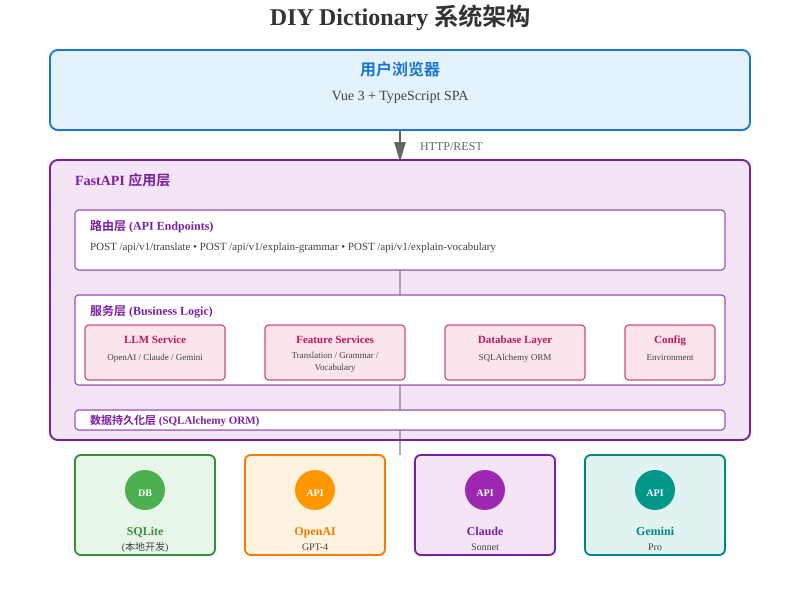
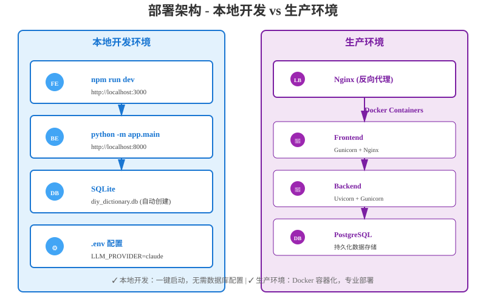

# 架构设计文档

## 概述

DIY Dictionary 是一个 LLM 驱动的英语学习工具，帮助用户通过语义、词汇和语法解释来理解句子。本文档描述系统架构、设计决策和扩展考虑。

## 系统架构



**架构特点**:
- **分层设计**: 表现层 → API 层 → 服务层 → 数据层，职责明确
- **提供商无关**: LLM Service 抽象所有提供商，支持 Claude/OpenAI/Gemini
- **本地友好**: SQLite 自动配置，开发无需额外服务
- **可扩展**: 易于添加新功能和数据模型

## 分层设计

### 1. 表现层（Frontend）
**技术**: Vue 3 + TypeScript + Vite

**职责**:
- 提供用户界面
- 处理用户交互（文本输入、文本选择）
- 渲染 LLM 返回的解释
- 状态管理 (Pinia)

**关键组件**:
- `TextInput.vue`: 英文句子输入
- `ExplanationDisplay.vue`: 显示 LLM 解释
- `SelectionHighlight.vue`: 文本选中高亮和上下文菜单

### 2. API 层（路由）
**框架**: FastAPI (Python)

**职责**:
- 接收 HTTP 请求
- 数据验证 (Pydantic schemas)
- 调用相应的服务层
- 返回 JSON 响应

**端点设计**:
```python
POST /api/v1/translate
{
    "text": "The quick brown fox jumps over the lazy dog",
    "source_lang": "en",
    "target_lang": "zh"
}

POST /api/v1/explain-grammar
{
    "text": "She has been working here for 5 years",
    "selected_text": "has been working"  # 可选
}

POST /api/v1/explain-vocabulary
{
    "word": "bank",
    "context": "I went to the bank to withdraw money",
    "explanation_type": "context_meaning"  # 或 "common_meanings", "familiar_new"
}
```

### 3. 服务层（业务逻辑）
**位置**: `app/services/`

#### LLM 服务 (`llm_service.py`)
**设计原则**: 提供商无关的抽象层

```python
class LLMService:
    async def translate(text, source_lang, target_lang) -> str
    async def explain_grammar(text, selected_text=None) -> str
    async def explain_vocabulary(word, context, explanation_type) -> str
    async def _call_llm(prompt) -> str  # 内部方法
```

**提供商支持**:
- OpenAI (GPT-4, GPT-3.5)
- Claude (via Anthropic API)
- Google Gemini

**配置**: 通过 `.env` 文件选择提供商

```env
LLM_PROVIDER=claude
LLM_MODEL=claude-3-5-sonnet-20241022
LLM_API_KEY=sk-ant-xxxxx
```

#### 功能服务
- `TranslationService`: 翻译专用逻辑（可能包括缓存、本地化等）
- `GrammarService`: 语法解释专用逻辑
- `VocabularyService`: 词汇解释专用逻辑

### 4. 数据持久化层
**ORM**: SQLAlchemy

**数据库支持**:
- **本地开发**: SQLite（自动创建 `diy_dictionary.db`）
- **生产环境**: PostgreSQL（需要通过环境变量配置）

**数据库迁移**: Alembic（未来扩展）

**现有模型** (计划):
- User（未来：用户账户、学习历史）
- QueryLog（可选：记录用户的学习历史）

## 配置管理

`app/config.py` 管理所有配置，支持多环境：

```python
class Settings:
    ENVIRONMENT: Enum  # "dev" | "prod" | "test"
    DATABASE_URL: str  # SQLite (dev) 或 PostgreSQL (prod)
    LLM_PROVIDER: str  # openai, claude, gemini
    LLM_API_KEY: str   # 从环境变量读取
    DEBUG: bool        # 根据环境自动设置
```

## 异步设计

所有 LLM 调用都是异步的，充分利用 FastAPI 的并发能力：

```python
@app.post("/api/v1/translate")
async def translate(request: TranslateRequest):
    result = await llm_service.translate(...)
    return result
```

## 扩展考虑

### 1. 用户认证与历史记录
```python
# 未来添加
class User(Base):
    id: int
    email: str
    created_at: datetime

class QueryHistory(Base):
    id: int
    user_id: int
    query_type: str  # translate, grammar, vocabulary
    input_text: str
    output: str
    created_at: datetime
```

### 2. 缓存策略
- Redis 缓存频繁查询（相同的句子/单词）
- 配置在 `config.py` 中，生产环境启用

### 3. 速率限制
- 使用 FastAPI middleware 实现
- 防止 API 滥用

### 4. 多语言支持
- 当前：仅英文 → 中文
- 未来：参数化源/目标语言

### 5. 本地 LLM 支持
- Ollama / LLaMA 2 集成（替代 API）
- 通过 `LLMService` 的提供商扩展实现

## 部署架构



**部署特点**:
- **本地开发**: SQLite 自动配置，快速迭代，无需外部依赖
- **生产环境**: Docker 容器化，PostgreSQL 数据库，Nginx 反向代理，云就绪

## 性能考虑

1. **异步操作**: LLM API 调用不阻塞其他请求
2. **CORS 配置**: 生产环境严格限制源
3. **错误处理**: 详细的错误信息用于调试（开发）和用户友好的错误消息（生产）
4. **数据库连接池**: SQLAlchemy 默认管理

## 安全考虑

1. **环境变量**: API 密钥从 `.env` 读取，不硬编码
2. **输入验证**: Pydantic schemas 验证所有请求
3. **CORS**: 只允许预配置的域
4. **SQL 注入**: SQLAlchemy ORM 防护
5. **敏感信息**: 不在日志中输出 API 密钥

## 监控与日志

```python
# app/core/logging.py (未来)
- 结构化日志（JSON 格式）
- LLM API 调用追踪
- 错误告警
```

## 总结

本架构设计优先考虑：
- ✅ **快速原型开发** (MVP 可在本地快速迭代)
- ✅ **可扩展性** (分层设计，易于添加功能)
- ✅ **多提供商支持** (LLM 提供商可切换)
- ✅ **生产就绪** (支持本地/生产环境切换，数据库迁移系统)
- ✅ **类型安全** (Python 类型注解，TypeScript 前端)
